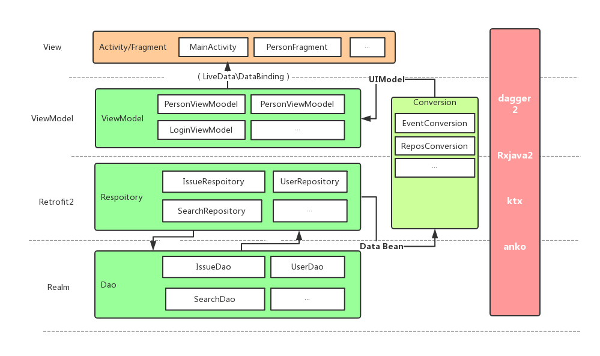

## Sentia Code Challenge     
## Code sample  
### 1. Project uses Kotlin; RxJava2; Android JetPack, please download the repository and import to Android Studio 

### 2. Test case is under app/src/test

### 3. Project structure (MVVM) 

